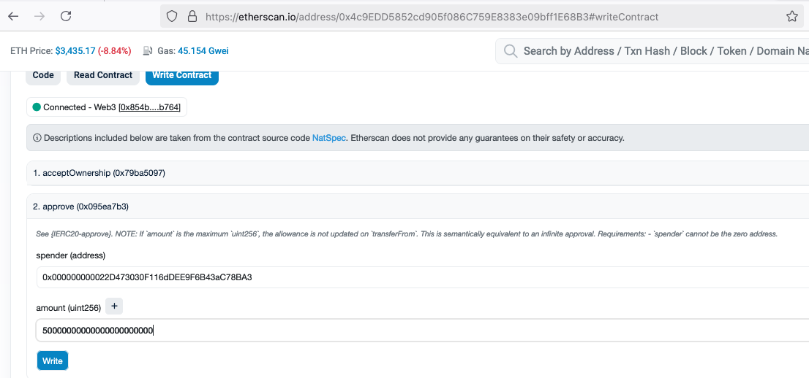
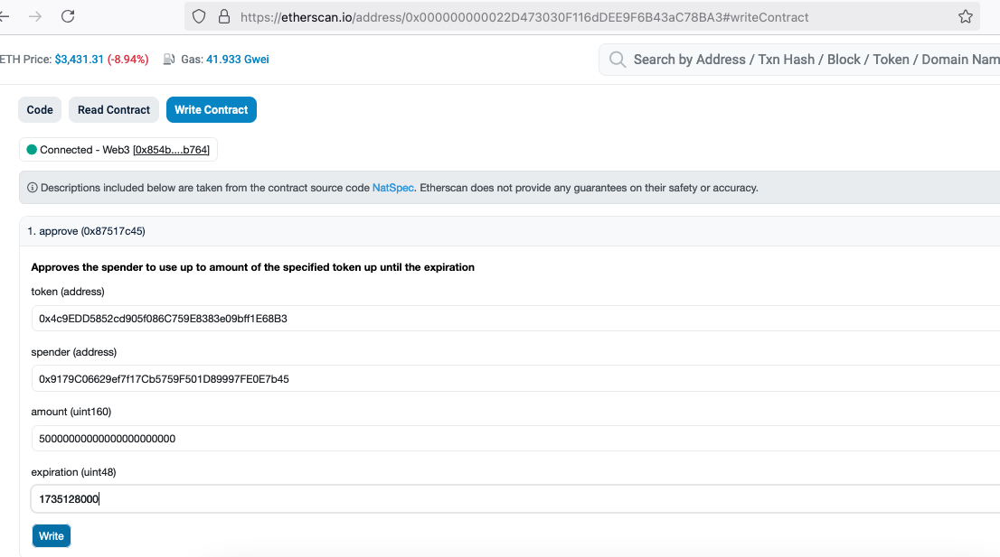

# Boosted Pools - Buffers

## Initializing Buffers for ERC4626 Tokens 

### Purpose

Partners who are interested in utilizing Balancer v3's Boosted pools will need to initialize buffers, which act as a direct route between the unwrapped and wrapped version of their token. These vaults must be initialized for any asset which utilizes an ERC4626 interface. For timelocked ERC4626 interface vaults (sUSDe or hgETH for example) Balancer suggest initializing buffers with a small amount of funds to avoid an init buffer front run on a swap.  

Buffers can be initiated with the underlying token only, or using a combination of the wrapped and unwrapped token. This is up to the depositor. For the purposes in this documentation we will utilize underlying assets only. These assets will be wrapped once the pool is interacted with by large swaps or disproportional join/exit events.

On Mainnet the suggested range of TVL is 50K USD for stablecoins, and in the range of 75k-150k USD for wETH and BTC derivatives. These values are subjective, utilizing less will only force swappers to pay higher gas fees as they are routed through the wrap and unwrap processes of the respective ERC4626 vaults. On

On layer 2s or low gas networks, we suggest several hundred dollars in each asset as gas costs are not a huge impact for pool events.

### Pre-requisites and related contracts

Each networks Buffer Router contract can be found in the respective chain folder in our [monorepo](https://github.com/balancer/balancer-deployments/tree/master/addresses) by searching "buffer-router". The mainnet one can be found [here](https://github.com/balancer/balancer-deployments/blob/e438df9dc2b9cb9f5ee31d34938d4ca58e942fb7/addresses/mainnet.json#L1314). 

The buffer router on mainnet is: [0x9179C06629ef7f17Cb5759F501D89997FE0E7b45](https://etherscan.io/address/0x9179C06629ef7f17Cb5759F501D89997FE0E7b45)

This process will require Permit2 as well. This address is canonical but do verify it on each chain as you go through this process.
Permit2: [0x000000000022D473030F116dDEE9F6B43aC78BA3](https://etherscan.io/address/0x000000000022D473030F116dDEE9F6B43aC78BA3)

### How to initialize a buffer

To initialize a buffer there are only three transactions to execute, assuming you have a sufficient token balance and the ERC4626 wrapper already created. These three transactions are:
1. Approving your underling token to be spent by Permit2
2. Approving the Buffer-Router using Permit2 to spend your underling tokens.
3. Calling initializeBuffer on the BuffferRouter.

In this example we will utilize Ethena's USDe and their Aave Statav2 ERC4626 wrapper. Depending on your token, you will require the wrapped token address and a balance of either the wrapped or unwrapped version. 
- USDe: [0x4c9EDD5852cd905f086C759E8383e09bff1E68B3](https://etherscan.io/address/0x4c9EDD5852cd905f086C759E8383e09bff1E68B3)
- waEthUSDe: [0x5F9D59db355b4A60501544637b00e94082cA575b](https://etherscan.io/address/0x5F9D59db355b4A60501544637b00e94082cA575b)

1. In this situation first step is go to the [USDe contract](https://etherscan.io/address/0x4c9EDD5852cd905f086C759E8383e09bff1E68B3#writeContract) and call approve:
We will pass 50,000 USD as 50000000000000000000000 since USDe has 18 decimals, and Permit2 [0x000000000022D473030F116dDEE9F6B43aC78BA3](https://etherscan.io/address/0x000000000022D473030F116dDEE9F6B43aC78BA3) as the spender:

2. Next we will go to the Permit2 contract and write the approve function with the following: 
token: 0x4c9EDD5852cd905f086C759E8383e09bff1E68B3
spender: 0x9179C06629ef7f17Cb5759F501D89997FE0E7b45
amount: 50000000000000000000000
expiration: 1735128000

We can get the time stamp from https://www.epochconverter.com/ , as long as it is far enough in the future of our execution date we will not have any issues. The initialization transaction will work until after that time.

3. Finally we will initialize the buffer by going to the buffer router [0x9179C06629ef7f17Cb5759F501D89997FE0E7b45](https://etherscan.io/address/0x9179C06629ef7f17Cb5759F501D89997FE0E7b45) and writing the initializeBuffer function. In this case we will pass the following data

wrappedToken: 0x5F9D59db355b4A60501544637b00e94082cA575b
exactAmountUnderlyingIn: 50000000000000000000000
exactAmountWrappedIn: 0
minIssuedShares: 49975000000000000000000

The minIssuedShares allows for miniscule slippage in the transaction but ultimately the whole balance to remove later on if desired, belongs to the depositor only. A 0.9995 multiplier is sufficient but this varies with decimals and deposit amounts. For smaller amounts, or if you receive a revert, consider a 0.995 multiplier. 

The buffer initialize can then be verified on the VaultExtension contract, [0x774cB66e2B2dB59A9daF175e9b2B7A142E17EB94](https://etherscan.io/address/0x774cB66e2B2dB59A9daF175e9b2B7A142E17EB94#readContract), by reading the function getBufferBalancer and getBufferOwnerShares functions. 